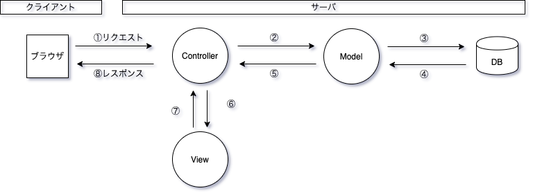
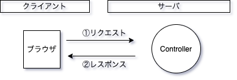
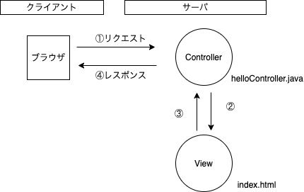
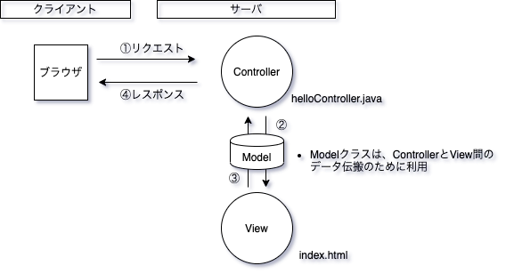
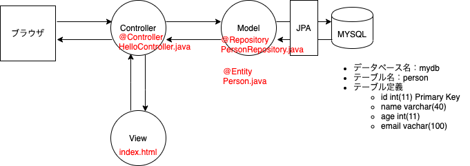

# SpringBoot勉強会

- SpringBoot2プログラミング入門という書籍をベースに勉強します。
- 当資料見出しの（1.1）などの番号は、書籍の章を示しています。

## Spring Bootって何？（1.1）

- JavaでWebアプリケーションを開発するためのフレームワーク

    - Spring Frameworkというフレームワーク群があり、その中の１つ

- フレームワークとは
    - 枠組み、骨組み
    - ライブラリとほぼ同じ意味
        - 何かプログラムを組む時、あらかじめ誰かが作ったプログラムを利用する。  
        その誰かが作ったプログラムのこと。
        - 例えば、java.util.Date、java.timeなど
        - フレームワークも誰かが作ったプログラム
    - ライブラリとフレームワークの違い
        - 呼び出し方向が違う
        - 自分のプログラムがライブラリを呼び出す
        - フレームワークが自分のプログラムを呼び出す


- Webアプリケーション関連のフレームワーク（Java）

    - MVCフレームワーク
        - Struts
        - JSF
        - Spring MVC

    - DBアクセスフレームワーク
        - Hibernate
        - iBatis
        - JDBC
            - Javaからデータベースにアクセスするための標準的なAPI
            - 何でも出来るが、自分で全てコーディング必要
        - JPA
            - なるべくSQLを書かないで済むことを目指しているフレームワーク
            - 比較的単純なSQLを発行するシステムに適する
            - 複雑なSQLを書かざる得ないシステムで適合しないことあり
        - myBatis
            - SQLは自分で書く。複雑なSQLでも対応可
            - SQLを外部ファイルで管理可
            - DB接続やエラー処理などある程度自動化
            - 現場で一番使われていると感じる


- その他言語のWebアプリケーションフレームワーク
    - Ruby -> Rails
    - Python -> Django
    - PHP -> Larabel


- Spring Bootとは
    - Spring MVCの完成形
    - "Railsライク"とも言われる高速開発可能なフレームワーク
    - Spring Framework群を組み合わせて最良のWebアプリケーション環境を素早く構築するためのスターターキット的なライブラリ
    - Spring Bootは、非常にシンプルにWebアプリケーションを構築することが出来る
    - 大規模システム開発現場でも採用されている


- Spring用の専用開発ツール Spring Tool Suite
    - STSと呼ぶ
    - Eclipseベース


- Spring Frameworkの概要
    - p6〜７参照


- Spring FrameworkによるWebアプリケーション開発
    - MVCアーキテクチャ
        - MVCアーキテクチャとは、**プログラムの整理整頓** のこと
            - Controllerは、プログラム全体を制御する役目のプログラム
            - Modelは、業務ロジック、データ管理をつかさどるプログラム
            - Viewは、画面の表示を扱う役目のプログラム
    



## STSを触ってみる（1.3）

- ビュー

- パースペクティブ
    - Springバースペクティブはどこ？


## プロジェクトを作って実行してみる（3.2）

- STSでMavenベースのプロジェクト作成／実行

    - プロジェクトを作る
        - Spring Starter Project

    - プロジェクトを実行する
        - Run As > Spring Boot App

    - ブラウザからアクセスする

        - http://localhost:8080
            - Springが起動しているので、Springのエラーページが見える
            - SpringBootはサーバー内蔵方式なので、プロジェクトを起動するだけで、アプリケーションを実行出来る。  
            サーバーへのデプロイは不要。

        - Springを停止し、再度アクセス
            - Springが止まっているので、アクセス出来ない

    - pom.xmlについて
        - 重要だけど一旦飛ばす

- STSでGradleベースのプロジェクト作成／実行
    - 飛ばす


## RestControllerを利用する（3.3）




- まず、RestControllerを使ってみる
    - RESTとは
        - Representational State Transferの略
        - 分散システムのアーキテクチャ
        - 外部システムにアクセスし、必要な情報を取得するような仕組みで利用される
        - 取得する情報の形式はJSONが多い（今回はTEXTをレスポンスする）
    
    - コントローラークラスをコーディングする時のポイント
        - @RestController
            - レストコントローラーに付与するアノテーション
        - @RequestMapping
            - リクエストしてきたURLパスと紐付けるメソッドに付与するアノテーション（URLマッピング）
            - このようなメソッドをリクエストハンドラという

- ブラウザが、あるURLをリクエストする
    - http://localhost:8080 へGETでリクエスト
- RestControllerが、リクエストされたURLに紐づくメソッドを実行し、ブラウザへレスポンスする
    - 文字列”Hello Spring!!"を返す


- ブラウザが、あるURLをリクエストする
    - http://localhost:8080/morning へGETでリクエスト
- RestControllerが、リクエストされたURLに紐づくメソッドを実行し、ブラウザへレスポンスする
    - 文字列”Good Morning!!"を返す


- httpのRequestとResponseを見てみる

    - chrome developer toolsを使う

    - Request Headers

        ```
        GET /morning HTTP/1.1
        Host: localhost:8080
        〜以下省略
        ```
    - Response Header

        ```
        HTTP/1.1 200
        Content-Type: text/html;charset=UTF-8
        Content-Length: 14
        Date: Sun, 12 Jul 2020 10:46:26 GMT
        Keep-Alive: timeout=60
        Connection: keep-alive
        ```

    - Response Body

        ```
        Good Morning!!
        ```

- パス変数を使ってみる （リスト3-9）
    - URLのパス部分の一部を変数（パス変数）として利用する
    - http://localhost:8080/100 の100の部分
    - @PathVariableでメソッドの引数に受け取る


- TEXTではなくJSONでレスポンスしてみる（リスト3-10）
    - リクエストハンドラの戻り値をClassにすると、Springが勝手にJSONに変換して、クライアントに返してくれる
    - JSONとは
      - データ定義言語
      - {"id": 1, "name": "yamada", "age": 28, "Birthplace": "Tokyo"}
      - Key：Value形式、全体を波括弧で括る、ダブルクオーテーションで括る、数値は括らない
      - プログラムが扱いやすいデータ形式なので、APIの戻り値はJSONのことが多い
      - 詳しくは → [JSON入門](http://www.tohoho-web.com/ex/json.html){:target="_blank"}

## ControllerとThymeleafを利用する（3.4）

- テンプレート（View）を表示する

    

    - Controllerクラスを作る（リスト3-13）
        - @Controller
        - return "パス/HTMLファイル名（拡張子除く）"
        - パスは、src/main/resources/templates からの相対パス

    - テンプレートファイルを作る（リスト3-14）
            - /resources/templates配下に保存
    
    - http://localhost:8080 へアクセス
    
    - （お題）templates配下にフォルダを作って、そこに新たなHTMLを作り表示してみる
      - src/resources/templates/hoge/fuga.html


- テンプレートに値を表示する

    

    - Controllerでmodelに値を登録し、その値をHTML上に埋め込んで表示する
    
    - Modelって何？
        - ControllerとView間で値をやり取りするためのオブジェクト
        - Springが予め準備しているMapオブジェクト
        - Mapオブジェクトとは、Key:Value形式で値を保存出来るオブジェクトのこと
        - 値を保存する時、addAttributeメソッドを使う
        - htmlに表示する時は、th:text="${hoge}"と書く

    - テンプレートを作る（リスト3-15）
      - htmlタグににThymeleafを使うための属性を追記
        - xmlns:th="http://www.thymeleaf.org"
      - HTML上で、modelに登録した値を表示したい箇所に、Thymeleafの独自属性であるth:textを追記
        - th:text="${hoge}"
            - ModelにhogeというKeyで保存した値を表示する
  
      - Controllerを作る（リスト3-16）
        - model.addAttribute("hoge", 値)
            - modelにhogeというKeyで値を保存する

    - クライアントから送信された値をテンプレートに表示する

        - リクエストURLのパスに入っている値をHTMLに表示してレスポンスする
            - Controllerで、パス変数を受け取り、Modelに保存する
            - Viewで、Modelから値を取得してHTMLを作る
            - Controllerで、HTMLをレスポンスする 
      
        - POSTされた値をHTMLに表示してレスポンスする
          - HTMLにFORMタグを追記し、POSTで値を送信する
          - Controllerで、POSTされた値を受け取り、modelに登録する
          - modelに登録した値を、HTMLに表示する

        - これまで、@RequestMappingを使っていたが、今回、@GetMappingと@PostMappingを使う
          - なぜなら、文字数が少なくて楽だから
          - @RequestMapping(value="/", method=RequestMethod.GET)は、@GetMapping("/")と書ける
          - このアノテーションは、Spring Frameworkの4.3から追加された

        

        - 次に、HTTPのメソッドをPOSTからGETに変えてみるとどうなる？
            - [URLとは](https://www.cman.jp/network/term/url/){:target="_blank"}
              - スキーム
              - ホスト
              - ドメイン
              - ポート番号
              - パス
              - クエリパラメータ

    - ModelAndViewって何？（Modelとの違いに着目）
        - ControllerとView間で値をやり取りするためのオブジェクト
        - Springが予め準備しているMapオブジェクト
        - Mapオブジェクトとは、Key:Value形式で値を保存出来るオブジェクトのこと
        - 値を保存する時、addObjectメソッドを使う（＊Modelと違う）
        - htmlに表示する時は、th:text="${hoge}"と書く
        - Controllerの戻り値は、ModelAndViewクラスのインスタンスとする（＊Modelと違う）
          - なぜなら、ModelAndViewクラスは、利用するテンプレート名などの情報を持っているから
          - Modelクラスは、テンプレート名などの情報を持ってないので、テンプレート名を戻り値としている

    - Modelで実装したものをModelAndViewで実装してみる
      - 飛ばす

## テンプレートエンジンを使いこなす（４章）

- Thymeleafの説明の内、大切と思った点をピックアップする（サラッと読んで、使うときに読み返す）
  - Thymeleafとは、テンプレートエンジン
    - テンプレートエンジンの基本は、テンプレートの中にコントローラー側で用意した値をはめ込んでレンダリングすること
    - Thymeleafは、値をすべてth:〜という属性の形で用意する
    - 属性の形で用意しているため、Thymeleafが機能していなくともページの表示に影響与えずに済む。
    - つまり、デザインとロジックを分離している。これが利点。
  - 変数式
    - ${}
    - 値を表示する
  - メッセージ式
    - #{}
    - src/main/resources/messages.propertiesに定義したメッセージを表示する
  - th:text="{person.name}" 
  - 選択オブジェクトへの変数式
    - th:objectを使ってオブジェクトを選択すると、そのタグの内部でプロパティ名だけで値を指定できる
      - th:object="${person}"
      - th:text="*{name}"
      - th:text="*{age}"
  - th:if="条件式"
    - 条件式がtrueの時、このタグと内部タグを表示する
  - th:unless="条件式"
    - 条件式がfalseの時、このタグと内部タグを表示する
  - th:each="変数:${コレクション}"
    - th:each="person:${persons}
  - `__${hoge}__`
    - プリプロセッシング
    - 変数式の前後にアンダーバーを２つずつ付けて記述
    - 変数式が先に評価される
  - テンプレートフラグメント
    - テンプレート側
      - th:fragment="フラグメント名"
    - 組み込む側
      - th:include="テンプレート名::フラグメント名"

## モデルとデータベース（５章）

### 全体概要

 


### DBの準備
- MYSQLをインストール
- mydbというDBを作成
- PersonというTableを作成
- テストデータを３件Insert
  
### プロジェクトの準備
- pom.xmlにJPAとMySqlを追加

```
<dependency>
	<groupId>org.springframework.boot</groupId>
	<artifactId>spring-boot-starter-data-jpa</artifactId>
</dependency>
<dependency>
	<groupId>mysql</groupId>
	<artifactId>mysql-connector-java</artifactId>
</dependency>
```

- applications.propertiesにDB接続設定を追加

```
spring.datasource.url=jdbc:mysql://localhost:3306/mydb
spring.datasource.username=root
spring.datasource.password=
spring.datasource.driver-class-name=com.mysql.cj.jdbc.Driver
```

  - [applications.propertiesの書き方参照](https://qiita.com/t-iguchi/items/685c0a1bb9b0e8ec68d2){:target="_blank"}
  - DBのユーザーはrootのままは良くない。アプリ用にユーザー作るのがふつう。

### 実装

- Entityクラスの作成
  - データベースのデータをJava内でオブジェクトとして扱えるようにするためのクラス
  - 非常にシンプルなPOJO
  - テーブルに対応するフィールドとアクセサ（ゲッター／セッター）を書く
  - @Entityアノテーションをつける
  - [@GeneratedValueについて、参考になった記事](https://qiita.com/KevinFQ/items/a6d92ec7b32911e50ffe){:target="_blank"}

- Repositoryクラスの作成
  - データベースにアクセスするためのメソッドを提供するクラス
  - インターフェースとして用意する
  - リポジトリは汎用的なデータベースアクセス処理を自動生成してくれる
  - @Repositoryアノテーションつける
  - JpaRepositoryを継承＜テーブル名、主キーの型＞

- Contorollerの作成（Repositoryを使う）
  - @Autowired
    - repositoryをContorollerのフィールドに関連付ける
    - これでrepositoryのインスタンスが自動的にrepositoryフィールドに設定される
    - p229の説明参照
  - リポジトリで取得する方法

  ```
  Iterable<Person> list = repository.findAll();
  または、List<Peron> list = repository.findAll();
  ```

    - 継承元であるJpaRepositoryに用意されているメソッド
    - Repositoryにメソッド書かなくても動く
    - findALL()は、select * from TBLなので、テーブル名さえわかればSQLを作れるからだろう
    - 今回の場合、select * from personを実行して、listに入れている

- テンプレート準備して画面に出力
  - テーブルのレコード全件表示する
    - 単純にコレクションをそのまま出力
    - PersonのtoString()をOverrideして出力 
    - テンプレートを修正して表形式で出力(th:eachを使う）
  - テーブルのレコードをidで抽出して表示する

     

    - index.htmlに入力欄と検索ボタンを追加
    - PersonRepositoryにfindById()を追加
    - HelloContorollerからfindById()を使う
  - 入力欄に何も入力しないで検索した時、全件検索とする
    - 対応案１
      - @RequestParamを使う
      - ID入力して検索
        - 対象データが無かった時、どうする？
      - 全件検索方法
        - 検索キーidはint型、nullを扱えない。どうする？
          - Integer型を使う。
      - 予期せぬ入力
        - 文字を入力された時、どうする？
        - スペース入力された時、どうする？
          - 1つずつ入力チェックするの辛い。バリデーションを使いたい。
 
    - 対応案２
      - formを使う
        - formに入力したデータをform用のクラスへバインディング
      - ID入力して検索
        - 対象データが無かった時、どうする？
      - 全件検索方法
        - 検索キーidはint型、nullを扱えない。どうする？
          - Integer型を使う。
      - 予期せぬ入力
        - バリデーション使う。
          - formクラスを用意して、バリデーション用のアノテーションを実装した。
        - エラー内容を画面に表示する。
          - th:each="error : ${#fields.detailedErrors()}を実装した。

- 前回は検索Rを実装した。今回は登録C、更新U、削除Dを実装する。



  - 作成する資材
    1. index.html ※localhost:8080/
    2. SearchForm.java ※検索画面用の入力フォーム 
    3. HelloController.java　※リクエストハンドラ　※画面毎に分けた方がいいかも
    4. Person.java ※entity（DBの値を入れるためのクラス）
    5. PersonRepository.java ※Dao（DB操作するためのクラス）
    6. register.html ※localhost:8080/register
    7. RegisterForm.java ※登録画面用の入力フォーム
    8. update.html ※localhost:8080/update
    9. UpdateForm.java ※更新画面用の入力フォーム
    10. delete.html ※localhost:8080/delete
    11. DeleteForm.java ※削除画面用の入力フォーム
  
  - 登録画面 実装手順
    - index.htmlを修正する
      - 登録画面のリンクを追加
    - register.htmlを作る
    - RegisterForm.javaを作る
    - HelloController.javaを修正する
      - /registerへのGet処理を追加
        - 登録画面を初期表示する
      - /registerへのPost処理を追加
        - バリデーションOKなら、RegisterFormからPersonへ入力値を詰めて、DBへInsertする。
        - IDはAuto Incrementしてるので入力させない。
        - バリデーションNGなら、/registerへ戻す。
  - 更新画面
    - index.htmlを修正する
      - 更新画面のリンクを追加
      - 変数の値をクエリパラメータにする場合
        - (パラメータ名=${変数名})とする。
        - th:href="@{/update(id="{person.id})}"
      - 変数の値をURLの一部として組み立てる場合
        - プレースホルダを{プレースホルダ名}で定義し、プレースホルダ名=${変数名}とする。
        - th:href="@{/update/{id}(id=${person.id})}"
    - update.htmlを作る
      - idはTBLのPrimaryKeyなので更新不可とする。
      - inputタグの属性でreadonlyかdisabledが使えそう。
        - disabledは値の引き継ぎが出来ない。
    - UpdateForm.javaを作る
    - HelloController.javaを修正する
      - /updateへのGet処理を追加
        - 更新画面を初期表示する
        - リクエストパラメータで取得したDBの値をupdateFormへ詰めてから画面表示する。
      - /updateへのPost処理を追加
        - バリデーションOKなら、UpdateFormからPersonへ入力値を詰めて、DBをUpdateする。
        - バリデーションNGなら、/updateへ戻す。
  - 削除画面
    - delete.htmlを作る
      - idはPostしたいのでinputタグで更新不可にする。
      - その他の項目は表示するだけで良い。
    - deleteForm.javaを作る
    - HelloController.javaを修正する
      - /deleteへのGet処理を追加
        - リクエストパラメータで取得したDBの値をdeleteFormへ詰めてから、画面表示する。
      - /deleteへのPost処理を追加
        - deleteFormのIDをKeyにrepository.deleteById()を使って、対象データを削除する。


## 参考

- 勉強会レジュメ作成の流れ
    - 環境準備
      - vscodeインストール
      - vscodeにDraw.io Integrationを入れる
    - レジュメ作成
      - markdownでレジュメを書く
      - Draw.ioで図表を書く
    - レジュメをGitHubへアップして、インターネットに公開する
      - GitHubに勉強会用のリポジトリを作成
      - ローカルのレジュメをGitHubへ登録
      - GitHub Pagesの設定
      - インターネットに公開した自分のレジュメを見てみる
    - 参照 → [GitHubを使ってMarkdown文書を５ステップでホームページとして公開する方法](https://qiita.com/MahoTakara/items/3800e9dc83b530d0a050){:target="_blank"}


## 次回、発表したい人、募集中🎶

  - 勉強会は発表する人が一番勉強出来ます♪
  - 勉強会に向けてモチベーションが上がります♪
  - プレゼンテーションの練習にもなります♪
